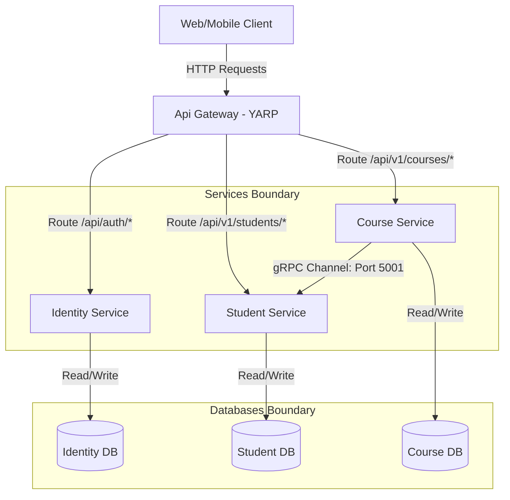
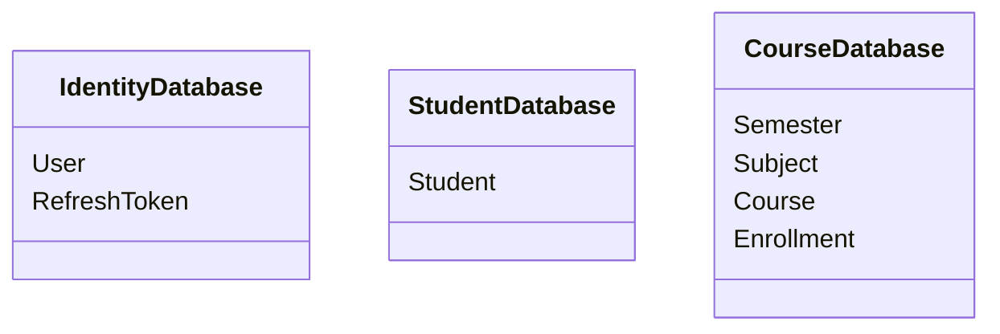
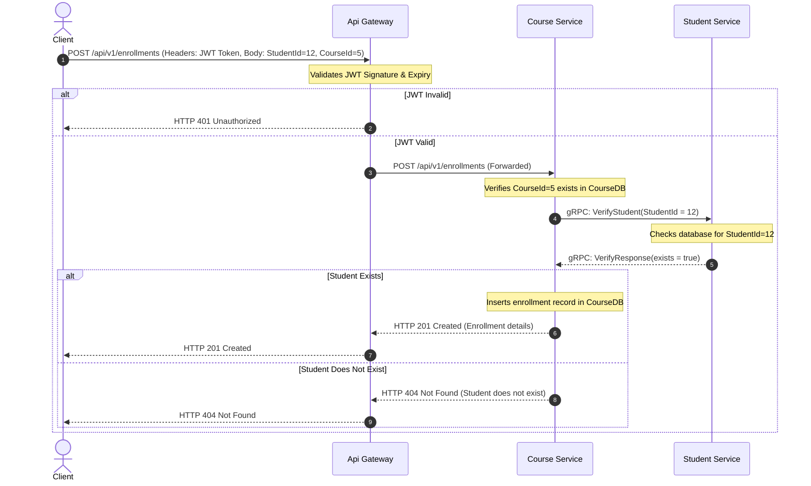

# Learning Management System (LMS) - Microservices Architecture Report
**Course:** PRN232 - Lab 3  
**Architecture Style:** Microservices & gRPC Integration  
**Framework:** .NET 8.0 / YARP API Gateway / PostgreSQL  

---

## 1. Introduction & Service Decomposition

The monolithic Learning Management System (LMS) from Lab 2 has been refactored into a modern, distributed microservices architecture. By decomposing the monolith, we achieve independent deployability, database isolation, language/technological flexibility, and optimized resource allocation.

The decomposed solution consists of **four primary services/components**:



### Decomposed Services:

1. **API Gateway (`ApiGateway`)**
   * **Role**: Single entry point for all client requests.
   * **Framework**: YARP (Yet Another Reverse Proxy).
   * **Responsibilities**: 
     * Routing incoming HTTP traffic to downstream REST hosts.
     * Centralized JWT Authentication validation (pre-validates tokens before forwarding).
     * Unified CORS management.

2. **Identity Service (`IdentityService`)**
   * **Role**: Handles user credentials, registration, and sessions.
   * **Responsibilities**:
     * User authentication & password hashing (using BCrypt).
     * JWT Access Token and Refresh Token generation.
     * Managing session expiry and token rotation.

3. **Student Service (`StudentService`)**
   * **Role**: Authority for student profile data.
   * **Responsibilities**:
     * Manage student details (Student Code, Full Name, Email, Phone, DOB).
     * Host RESTful API endpoints for administrative CRUD operations.
     * **gRPC Server**: Exposes RPC methods to other internal services for high-speed student verification and lookup.

4. **Course Service (`CourseService`)**
   * **Role**: Manages Semesters, Subjects, Courses, and Student Enrollments.
   * **Responsibilities**:
     * CRUD operations for semesters, subjects, and courses.
     * Manages enrollments (associating a student with a course).
     * **gRPC Client**: Communicates synchronously with the Student Service to verify that students exist before allowing course enrollments, and resolving student profile details for enrollment reports.

---

## 2. Database Design & Isolation

Following microservices best practices, **direct cross-service database access is strictly prohibited**. Each service owns its dedicated PostgreSQL database, ensuring loose coupling and database schema encapsulation.



### Database Isolation Details:
* **`lmsidentity`**: Holds user account information and refresh tokens for authentication.
* **`lmsstudent`**: Holds student demographic data, indexed by a unique `StudentCode` (e.g. `SE190001`).
* **`lmscourse`**: Holds course offerings, semesters, subjects, and enrollments.

### Decoupling the Enrollment Entity:
In the original monolith, the `Enrollment` table had a physical foreign key constraint pointing to the `Student` table. In the microservices architecture, they reside in separate databases. 
* The physical foreign key constraint in `CourseDB` was **removed**.
* The `StudentId` in the `Enrollment` table is now a **logical reference** (foreign key in spirit).
* **Data Integrity Enforcement**: When an enrollment is created, the `CourseService` queries the `StudentService` via gRPC to check if the student exists. If the student does not exist, the enrollment transaction is rejected with an HTTP `404 Not Found` response.

---

## 3. API Gateway Configuration & Routing

The API Gateway is built on **YARP (Yet Another Reverse Proxy)**. It intercepts all incoming requests, performs JWT verification, and proxies the traffic.

### Routing Table Setup:
Requests are intercepted based on route templates and mapped to service clusters:

| Route ID | Route Matching Path | Destination Cluster | Required Authorization Policy |
| :--- | :--- | :--- | :--- |
| `auth-route` | `/api/auth/{**catch-all}` | `identity-cluster` (IdentityService) | None (Public) |
| `students-route` | `/api/v{version}/students/{**catch-all}` | `student-cluster` (StudentService) | `GatewayAuthPolicy` (JWT Verified) |
| `courses-route` | `/api/v{version}/courses/{**catch-all}` | `course-cluster` (CourseService) | `GatewayAuthPolicy` (JWT Verified) |
| `enrollments-route` | `/api/v{version}/enrollments/{**catch-all}` | `course-cluster` (CourseService) | `GatewayAuthPolicy` (JWT Verified) |
| `semesters-route` | `/api/v{version}/semesters/{**catch-all}` | `course-cluster` (CourseService) | `GatewayAuthPolicy` (JWT Verified) |
| `subjects-route` | `/api/v{version}/subjects/{**catch-all}` | `course-cluster` (CourseService) | `GatewayAuthPolicy` (JWT Verified) |

### JWT Pre-Validation Pipeline:
When a client requests a protected route:
1. YARP matches the route and notices it requires `GatewayAuthPolicy`.
2. The gateway's built-in `JwtBearer` authentication middleware extracts the token from the `Authorization` header and validates its signature, issuer, audience, and expiration.
3. If validation fails, the gateway immediately returns `401 Unauthorized` without calling the downstream services.
4. Downstream services also double-check authorization and parse the JWT claims (such as User Roles) to enforce granular checks like `[Authorize(Roles = "Admin")]`.

---

## 4. gRPC Communication Flow

To avoid slow and untyped HTTP REST calls between services, **gRPC** was implemented for service-to-service communication. Protocol Buffers (Proto3) are used to declare strongly-typed schemas.

### 4.1 Protocol Buffer Definition (`student.proto`)
The communication contracts are defined in a shared Protobuf file:

```protobuf
syntax = "proto3";
option csharp_namespace = "PRN232.LMSSystem.Grpc";
package student;

service StudentGrpc {
  rpc GetStudentById (StudentRequest) returns (StudentResponse);
  rpc GetStudentsByIds (StudentsRequest) returns (StudentsResponse);
  rpc VerifyStudent (StudentRequest) returns (VerifyResponse);
}

message StudentRequest {
  int32 student_id = 1;
}

message StudentsRequest {
  repeated int32 student_ids = 1;
}

message StudentResponse {
  int32 student_id = 1;
  string student_code = 2;
  string full_name = 3;
  string email = 4;
  string phone = 5;
  string date_of_birth = 6;
}

message StudentsResponse {
  repeated StudentResponse students = 1;
}

message VerifyResponse {
  bool exists = 1;
}
```

### 4.2 gRPC Client-Server Flow: Enrollment Example

When a client initiates a student enrollment into a course:



### 4.3 Batch Resolution Flow for Course Students Lists
When querying `/api/v1/courses/{id}/students` to see all enrolled students:
1. `CourseService` queries its own `Enrollment` table to get all `StudentId`s enrolled in the course.
2. It groups these IDs and calls `GetStudentsByIds` via gRPC to `StudentService`.
3. `StudentService` executes a high-speed batch SQL query (`WHERE "StudentId" = ANY(...)`) and returns the list of student objects in one gRPC response payload.
4. `CourseService` maps this data together and returns the resolved student list to the client, preventing any N+1 query issue.

---

## 5. Security & Deployment

### Authentication & Authorization (JWT):
* Enforces role-based authorization: endpoints such as student creation and deletion require `[Authorize(Roles = "Admin")]`.
* Uses `HMAC-SHA256` keys to sign tokens. Refresh tokens are stored in the `lmsidentity` database with rotation and revocation capabilities.

### Deployment Architecture (Docker Compose):
The services are containerized and deployed using `docker-compose.yml` with separate databases and private networking boundaries:
* **Private Network (`lms-network`)**: The microservices interact over a isolated internal Docker network.
* **Exposed Gateway**: Only the `api-gateway` exposes its port (`8080`) to the host, protecting backend microservices from direct public access.
* **Independent Database Hosts**: `identity-db`, `student-db`, and `course-db` run on isolated container ports, keeping their data storage completely decoupled.

---
*Report compiled and verified successfully. End of report.*
