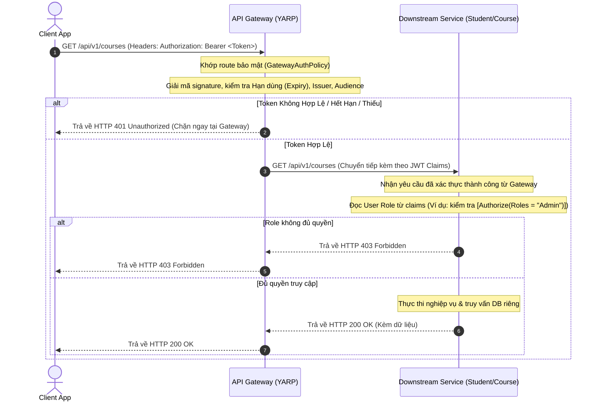

# Hướng Dẫn Chi Tiết Luồng Hoạt Động Hệ Thống LMS (Microservices & gRPC)

Tài liệu này mô tả chi tiết các luồng hoạt động (workflow/sequence flow) của hệ thống Learning Management System (LMS) sau khi được phân rã từ Monolith sang Kiến trúc Microservices.

---

## 1. Bản Đồ Tổng Quan Hệ Thống

Hệ thống bao gồm các thành phần chạy độc lập trên các cổng (Port) sau khi chạy local hoặc trong container:

* **API Gateway (YARP)**: `http://localhost:5265` (Điểm tiếp nhận duy nhất từ Client)
* **Identity Service (Auth)**: `http://localhost:5000` (Cơ sở dữ liệu: `lmsidentity`)
* **Student Service (Quản lý Sinh viên)**: `http://localhost:5004` (gRPC Server: Port `5001`, Cơ sở dữ liệu: `lmsstudent`)
* **Course Service (Quản lý Khóa học & Đăng ký)**: `http://localhost:5208` (Cơ sở dữ liệu: `lmscourse`)

---

## 2. Luồng Hoạt Động Chi Tiết

### Luồng 1: Đăng Nhập & Cấp Phát Access Token (Authentication Flow)
Mục đích: Xác thực thông tin người dùng và sinh ra mã JWT.

```mermaid
sequenceDiagram
    autonumber
    actor Client as Client App
    participant GW as API Gateway (YARP)
    participant ID as Identity Service
    database DB as Identity DB (lmsidentity)

    Client->>GW: POST /api/auth/login { username, password }
    Note over GW: Nhận diện route công khai, chuyển tiếp gói tin sang Identity Service
    GW->>ID: POST /api/auth/login (Chuyển tiếp)
    ID->>DB: Truy vấn thông tin User bằng username
    DB-->>ID: Trả về thông tin User & PasswordHash
    Note over ID: So sánh password gửi lên với PasswordHash (dùng BCrypt)
    
    alt Thông tin hợp lệ
        Note over ID: Tạo mới Access Token (JWT) chứa: UserId, Username, Role
        Note over ID: Tạo mới Refresh Token và lưu vào database
        ID->>DB: Lưu Refresh Token mới
        ID-->>GW: Trả về HTTP 200 { AccessToken, RefreshToken }
        GW-->>Client: Trả về HTTP 200 { AccessToken, RefreshToken }
    else Thông tin sai lệch
        ID-->>GW: Trả về HTTP 401 Unauthorized
        GW-->>Client: Trả về HTTP 401 Unauthorized
    end
```

---

### Luồng 2: Xác Thực & Phân Quyền Yêu Cầu (Authorization at Gateway)
Mục đích: Đảm bảo các API bảo mật được kiểm tra JWT hợp lệ trước khi chạm tới các service nghiệp vụ phía sau.



---

### Luồng 3: Đăng Ký Học Phần & Xác Thực Sinh Viên Qua gRPC
Mục đích: Khi đăng ký học phần, Course Service (nắm giữ thông tin đăng ký) cần kiểm tra sinh viên đó có thực sự tồn tại bên Student Service (nắm giữ thông tin sinh viên) hay không mà không được truy cập trực tiếp database của nhau.

```mermaid
sequenceDiagram
    autonumber
    actor Client as Client App
    participant GW as API Gateway (YARP)
    participant Course as Course Service
    participant Student as Student Service
    database CourseDB as Course DB (lmscourse)
    database StudentDB as Student DB (lmsstudent)

    Client->>GW: POST /api/v1/enrollments { studentId: 3, courseId: 4 } (Kèm JWT)
    Note over GW: Xác thực JWT hợp lệ
    GW->>Course: POST /api/v1/enrollments (Chuyển tiếp)
    Note over Course: Nhận yêu cầu đăng ký
    
    Note over Course: [GỌI gRPC SERVER] Khởi tạo kênh kết nối nhanh gRPC
    Course->>Student: gRPC: VerifyStudent (student_id = 3)
    
    Student->>StudentDB: Kiểm tra sinh viên có tồn tại trong bảng Student
    StudentDB-->>Student: Trả về thông tin sinh viên
    
    alt Sinh viên không tồn tại
        Student-->>Course: gRPC Trả về VerifyResponse { exists = false }
        Note over Course: Kích hoạt luật Validation
        Course-->>GW: Trả về HTTP 400 Bad Request { error: "Sinh viên không tồn tại" }
        GW-->>Client: Trả về HTTP 400 Bad Request
    else Sinh viên tồn tại
        Student-->>Course: gRPC Trả về VerifyResponse { exists = true }
        Course->>CourseDB: Kiểm tra xem đã đăng ký khóa học này chưa
        CourseDB-->>Course: Kết quả kiểm tra trùng lặp
        
        alt Đã đăng ký rồi (Trùng lặp)
            Course-->>GW: Trả về HTTP 400 Bad Request { error: "Bản ghi đăng ký đã tồn tại" }
            GW-->>Client: Trả về HTTP 400 Bad Request
        else Chưa đăng ký (Hợp lệ)
            Course->>CourseDB: Lưu bản ghi mới vào bảng Enrollment
            CourseDB-->>Course: OK
            Course-->>GW: Trả về HTTP 201 Created (Thông tin đăng ký)
            GW-->>Client: Trả về HTTP 201 Created
        end
    end
```

---

### Luồng 4: Lấy Danh Sách Sinh Viên Của Khóa Học (Batch Resolving Flow)
Mục đích: Khi gọi API lấy thông tin sinh viên thuộc một lớp học (`GET /api/v1/courses/{id}/students`), Course Service cần trả về cả họ tên, email của sinh viên từ Student Service.

```mermaid
sequenceDiagram
    autonumber
    actor Client as Client App
    participant GW as API Gateway (YARP)
    participant Course as Course Service
    participant Student as Student Service
    database CourseDB as Course DB (lmscourse)
    database StudentDB as Student DB (lmsstudent)

    Client->>GW: GET /api/v1/courses/1/students (Kèm JWT)
    GW->>Course: GET /api/v1/courses/1/students
    
    Course->>CourseDB: Truy vấn bảng Enrollment lấy toàn bộ StudentId đăng ký CourseId = 1
    CourseDB-->>Course: Trả về danh sách ví dụ: [1, 2, 5]
    
    alt Danh sách rỗng
        Course-->>GW: Trả về HTTP 200 OK với mảng rỗng []
        GW-->>Client: Trả về []
    else Có danh sách StudentId [1, 2, 5]
        Note over Course: [GỌI gRPC SERVER] Gom nhóm ID gửi yêu cầu hàng loạt
        Course->>Student: gRPC: GetStudentsByIds (student_ids = [1, 2, 5])
        
        Student->>StudentDB: SELECT * FROM Student WHERE StudentId IN (1, 2, 5)
        StudentDB-->>Student: Trả về thông tin chi tiết (FullName, Email, Code)
        
        Student-->>Course: gRPC Trả về StudentsResponse (Danh sách thông tin sinh viên)
        Note over Course: Map ghép thông tin Sinh viên với dữ liệu lớp học
        Course-->>GW: Trả về HTTP 200 OK (Danh sách sinh viên đầy đủ thông tin chi tiết)
        GW-->>Client: Trả về HTTP 200 OK
    end
```

---

### Luồng 5: Lấy Danh Sách Học Phần Đăng Ký Của Một Sinh Viên
Mục đích: API Gateway định tuyến thông minh yêu cầu `/api/v1/students/{id}/enrollments` đến Course Service vì Course Service nắm giữ cơ sở dữ liệu `Enrollment`.

```mermaid
sequenceDiagram
    autonumber
    actor Client as Client App
    participant GW as API Gateway (YARP)
    participant Course as Course Service
    participant Student as Student Service
    database CourseDB as Course DB (lmscourse)

    Client->>GW: GET /api/v1/students/1/enrollments (Kèm JWT)
    Note over GW: Nhận diện đường dẫn chứa '/students/{id}/enrollments'
    Note over GW: Định tuyến sang Course Service (không gửi sang Student Service)
    GW->>Course: GET /api/v1/students/1/enrollments
    
    Note over Course: Gọi gRPC VerifyStudent(student_id = 1) để xác minh sinh viên có thật không
    Course->>Student: gRPC: VerifyStudent (student_id = 1)
    Student-->>Course: gRPC: VerifyResponse (exists = true)
    
    alt Sinh viên tồn tại
        Course->>CourseDB: SELECT * FROM Enrollment WHERE StudentId = 1
        CourseDB-->>Course: Trả về danh sách các khóa học đã đăng ký
        Course-->>GW: Trả về HTTP 200 OK (Dữ liệu danh sách học phần)
        GW-->>Client: Trả về HTTP 200 OK
    else Sinh viên không tồn tại
        Course-->>GW: Trả về HTTP 404 Not Found (Sinh viên không tồn tại)
        GW-->>Client: Trả về HTTP 404 Not Found
    end
```

---

## 3. Tổng Kết Các Quy Tắc Định Tuyến (Routing) Của Gateway

Để đảm bảo các luồng hoạt động chính xác như trên, API Gateway cấu hình các bộ định tuyến trong tệp `appsettings.json` theo độ ưu tiên:

1. **`student-enrollments-route`**: Bắt các đường dẫn `/api/v1/students/{id}/enrollments` và đẩy về `Course Service`.
2. **`students-route`**: Bắt tất cả các đường dẫn `/api/v1/students/{**catch-all}` còn lại và đẩy về `Student Service`.
3. **`courses-route`**, **`enrollments-route`**, **`semesters-route`**, **`subjects-route`**: Đẩy toàn bộ về `Course Service`.
4. **`auth-route`**: Đẩy toàn bộ các cuộc gọi `/api/auth/*` về `Identity Service` không yêu cầu JWT kiểm tra trước.
