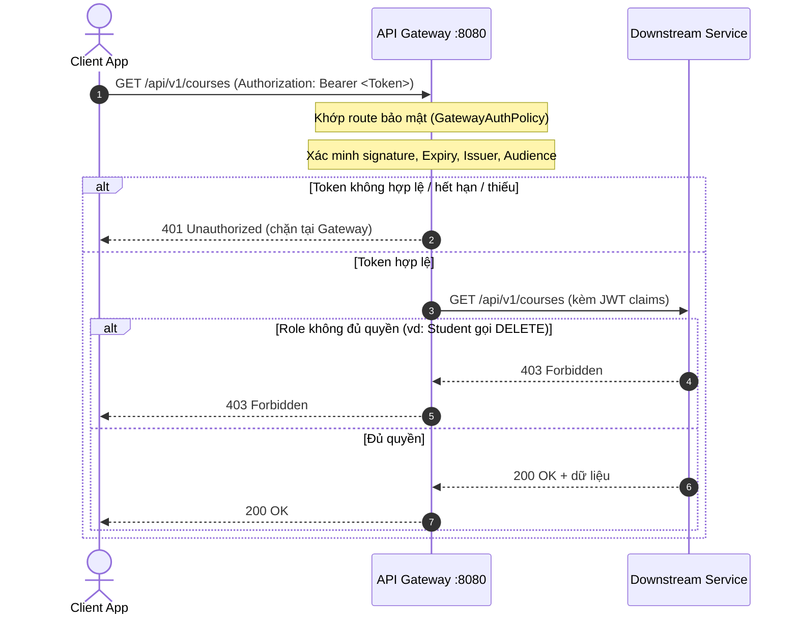

# Hướng Dẫn Chi Tiết Luồng Hoạt Động Hệ Thống LMS (Microservices & gRPC)

Tài liệu này mô tả chi tiết các luồng hoạt động (workflow/sequence flow) của hệ thống Learning Management System (LMS) được xây dựng theo kiến trúc Microservices.

---

## 1. Bản Đồ Tổng Quan Hệ Thống

Toàn bộ stack chạy bằng Docker Compose. Các cổng truy cập từ máy host:

| Thành phần | Host Port | Mô tả |
|---|---|---|
| **API Gateway (YARP)** | `8080` | Điểm tiếp nhận duy nhất từ Client |
| **Identity Service** | `8081` (Swagger) | Xác thực, cấp JWT (DB: `LmsIdentity`) |
| **Student Service** | `8082` (Swagger), `5001` (gRPC) | Quản lý Sinh viên (DB: `LmsStudent`) |
| **Course Service** | `8083` (Swagger) | Quản lý Khoá học & Đăng ký (DB: `LmsCourse`) |
| **PostgreSQL — Identity** | `5433` | |
| **PostgreSQL — Student** | `5434` | |
| **PostgreSQL — Course** | `5435` | |
| **Redis** | `6379` | Distributed Cache cho gRPC responses |
| **RabbitMQ** | `5672` (AMQP), `15672` (Management UI) | Async event messaging |
| **Jaeger** | `16686` (UI), `4317` (OTLP gRPC) | Distributed Tracing |

### Kiến Trúc Tổng Quan

```
Client
  │
  ▼
API Gateway :8080  (YARP Reverse Proxy + JWT Auth)
  │
  ├──► Identity Service :8080  (Authentication)
  │         └── PostgreSQL LmsIdentity
  │
  ├──► Student Service :8080   (REST API)
  │         ├── PostgreSQL LmsStudent
  │         └── gRPC Server :5001
  │                 ▲  (được gọi bởi CourseService)
  │
  └──► Course Service :8080    (REST API + gRPC Client + Redis + MassTransit Publisher)
            ├── PostgreSQL LmsCourse
            ├── Redis Cache (TTL 5 phút)
            └── RabbitMQ Publisher
                    │
                    ▼
            Student Service (MassTransit Consumer)
                    └── Xử lý EnrollmentCreated & StatusChanged events
```

---

## 2. Luồng Hoạt Động Chi Tiết

### Luồng 1: Đăng Nhập & Cấp Phát Access Token (Authentication Flow)

Mục đích: Xác thực thông tin người dùng và sinh ra mã JWT.

```mermaid
sequenceDiagram
    autonumber
    actor Client as Client App
    participant GW as API Gateway :8080
    participant ID as Identity Service :8080
    database DB as Identity DB (LmsIdentity)

    Client->>GW: POST /api/auth/login { username, password }
    Note over GW: Route công khai, không kiểm tra JWT, chuyển tiếp
    GW->>ID: POST /api/auth/login (Chuyển tiếp)
    ID->>DB: Truy vấn User theo username
    DB-->>ID: User info + PasswordHash (BCrypt)

    alt Thông tin hợp lệ
        Note over ID: Tạo AccessToken JWT (UserId, Username, Role)
        Note over ID: Tạo RefreshToken → lưu DB
        ID->>DB: INSERT RefreshToken
        ID-->>GW: 200 OK { accessToken, refreshToken }
        GW-->>Client: 200 OK { accessToken, refreshToken }
    else Sai mật khẩu / không tồn tại
        ID-->>GW: 401 Unauthorized
        GW-->>Client: 401 Unauthorized
    end
```

**Tài khoản mặc định (password: `123456`):**
- `admin` — Role: Admin
- `student` — Role: Student

---

### Luồng 2: Xác Thực & Phân Quyền Tại Gateway

Mục đích: Đảm bảo các API bảo mật được kiểm tra JWT trước khi tới service nghiệp vụ.



**Phân quyền:**
- Tất cả GET/POST/PUT: `[Authorize]` — cần JWT hợp lệ (mọi role)
- Tất cả DELETE: `[Authorize(Roles = "Admin")]` — chỉ Admin

---

### Luồng 3: Đăng Ký Học Phần & Xác Thực Sinh Viên Qua gRPC

Mục đích: CourseService kiểm tra sinh viên tồn tại bên StudentService qua gRPC (không truy cập DB chéo).

```mermaid
sequenceDiagram
    autonumber
    actor Client as Client App
    participant GW as API Gateway :8080
    participant Course as Course Service :8080
    participant Student as Student Service (gRPC :5001)
    database CourseDB as LmsCourse
    database StudentDB as LmsStudent

    Client->>GW: POST /api/v1/enrollments { studentId, courseId, ... } (JWT)
    GW->>Course: POST /api/v1/enrollments (chuyển tiếp)

    Course->>Student: gRPC VerifyStudent(studentId)
    Student->>StudentDB: SELECT WHERE StudentId = ?
    StudentDB-->>Student: Kết quả

    alt Sinh viên không tồn tại
        Student-->>Course: VerifyResponse { exists: false }
        Course-->>GW: 400 Bad Request "Student does not exist"
        GW-->>Client: 400 Bad Request
    else Sinh viên tồn tại
        Student-->>Course: VerifyResponse { exists: true }
        Course->>CourseDB: Kiểm tra trùng (StudentId, CourseId)

        alt Đã đăng ký rồi
            Course-->>GW: 400 Bad Request "Enrollment already exists"
            GW-->>Client: 400 Bad Request
        else Hợp lệ
            Course->>CourseDB: INSERT Enrollment
            Note over Course: Publish EnrollmentCreatedEvent → RabbitMQ
            Course-->>GW: 201 Created (EnrollmentResponse)
            GW-->>Client: 201 Created
        end
    end
```

**Sau khi tạo thành công:** StudentService nhận event qua RabbitMQ và ghi log:
```
[RabbitMQ] Enrollment created — StudentId=X enrolled in Course 'Y'...
```

---

### Luồng 4: Lấy Danh Sách Sinh Viên Của Khóa Học (Batch gRPC + Redis Cache)

Mục đích: CourseService gom lô studentId → gọi 1 lần gRPC `GetStudentsByIds`. Kết quả được cache Redis 5 phút.

```mermaid
sequenceDiagram
    autonumber
    actor Client as Client App
    participant GW as API Gateway :8080
    participant Course as Course Service :8080
    participant Redis as Redis Cache
    participant Student as Student Service (gRPC :5001)
    database CourseDB as LmsCourse
    database StudentDB as LmsStudent

    Client->>GW: GET /api/v1/courses/1/students (JWT)
    GW->>Course: GET /api/v1/courses/1/students

    Course->>CourseDB: SELECT StudentId FROM Enrollment WHERE CourseId = 1
    CourseDB-->>Course: [1, 2, 5, ...]

    loop Mỗi studentId
        Course->>Redis: GET student:{id}
        alt Cache hit
            Redis-->>Course: StudentResponse (từ cache)
        else Cache miss
            Note over Course: Gom các id bị miss lại
        end
    end

    alt Có cache miss
        Course->>Student: gRPC GetStudentsByIds([miss_ids])
        Student->>StudentDB: SELECT * WHERE StudentId IN (...)
        StudentDB-->>Student: Danh sách sinh viên
        Student-->>Course: StudentsResponse
        Course->>Redis: SET student:{id} (TTL 5 phút) cho từng kết quả
    end

    Course-->>GW: 200 OK (danh sách sinh viên đầy đủ)
    GW-->>Client: 200 OK
```

---

### Luồng 5: Định Tuyến Thông Minh — Enrollments Của Sinh Viên

Mục đích: Gateway định tuyến `/api/v1/students/{id}/enrollments` sang **CourseService** thay vì StudentService vì CourseService nắm giữ bảng Enrollment.

```mermaid
sequenceDiagram
    autonumber
    actor Client as Client App
    participant GW as API Gateway :8080
    participant Course as Course Service :8080
    participant Student as Student Service (gRPC :5001)
    database CourseDB as LmsCourse

    Client->>GW: GET /api/v1/students/1/enrollments (JWT)
    Note over GW: Route "student-enrollments-route" → Course Service
    Note over GW: (Không gửi sang Student Service)
    GW->>Course: GET /api/v1/students/1/enrollments

    Course->>Student: gRPC VerifyStudent(studentId=1)
    Student-->>Course: VerifyResponse { exists: true }

    alt Sinh viên tồn tại
        Course->>CourseDB: SELECT * FROM Enrollment WHERE StudentId = 1
        CourseDB-->>Course: Danh sách khóa học đã đăng ký
        Course-->>GW: 200 OK (EnrollmentOfStudentResponse[])
        GW-->>Client: 200 OK
    else Sinh viên không tồn tại
        Course-->>GW: 400 Bad Request
        GW-->>Client: 400 Bad Request
    end
```

---

### Luồng 6: Async Event — Thay Đổi Trạng Thái Đăng Ký (RabbitMQ)

Mục đích: Khi trạng thái enrollment thay đổi, CourseService publish event bất đồng bộ; StudentService consume và xử lý độc lập.

```mermaid
sequenceDiagram
    autonumber
    actor Client as Client App
    participant GW as API Gateway :8080
    participant Course as Course Service :8080
    participant RMQ as RabbitMQ
    participant Student as Student Service (Consumer)
    database CourseDB as LmsCourse

    Client->>GW: PUT /api/v1/enrollments/1 { status: "Completed" } (JWT)
    GW->>Course: PUT /api/v1/enrollments/1

    Course->>CourseDB: UPDATE Enrollment SET Status = 'Completed'
    CourseDB-->>Course: OK

    alt Trạng thái thực sự thay đổi (oldStatus ≠ newStatus)
        Course--)RMQ: Publish EnrollmentStatusChangedEvent { oldStatus, newStatus }
        Course-->>GW: 200 OK
        GW-->>Client: 200 OK

        RMQ--)Student: Deliver EnrollmentStatusChangedEvent
        Note over Student: Log: "Enrollment status changed Active → Completed"
    else Trạng thái không đổi
        Course-->>GW: 200 OK (không publish event)
        GW-->>Client: 200 OK
    end
```

---

## 3. Tổng Kết Routing Của API Gateway

| Route | Path Pattern | Cluster đích | Auth |
|---|---|---|---|
| `auth-route` | `/api/auth/{**catch-all}` | Identity Service | Không |
| `student-enrollments-route` | `/api/v{version}/students/{id}/enrollments` | **Course Service** | Cần JWT |
| `students-route` | `/api/v{version}/students/{**catch-all}` | Student Service | Cần JWT |
| `courses-route` | `/api/v{version}/courses/{**catch-all}` | Course Service | Cần JWT |
| `enrollments-route` | `/api/v{version}/enrollments/{**catch-all}` | Course Service | Cần JWT |
| `semesters-route` | `/api/v{version}/semesters/{**catch-all}` | Course Service | Cần JWT |
| `subjects-route` | `/api/v{version}/subjects/{**catch-all}` | Course Service | Cần JWT |

> **Lưu ý quan trọng:** Route `student-enrollments-route` phải được đặt **trước** `students-route` trong config để YARP ưu tiên match pattern cụ thể hơn.

---

## 4. Các Tính Năng Kỹ Thuật Nâng Cao

| Tính năng | Công nghệ | Mô tả |
|---|---|---|
| **Distributed Tracing** | OpenTelemetry + Jaeger | Trace toàn bộ request qua 4 services. Xem tại http://localhost:16686 |
| **Distributed Cache** | Redis (StackExchange.Redis) | Cache student info 5 phút, giảm gRPC calls từ CourseService |
| **Resilience** | Polly (Retry + Circuit Breaker) | Retry 3 lần (exponential backoff), circuit breaker mở sau 5 lỗi liên tiếp |
| **Async Messaging** | MassTransit + RabbitMQ | CourseService publish, StudentService consume enrollment events |
| **Structured Logging** | Serilog | JSON logs có correlation với tracing |
| **API Versioning** | Asp.Versioning | URL segment: `/api/v1/...`, mặc định v1.0 |
| **Data Shaping** | Custom IDataShaper | Query param `?fields=id,name` để chọn fields trả về |
| **Validation** | FluentValidation | Server-side validation với lỗi chi tiết theo field |
